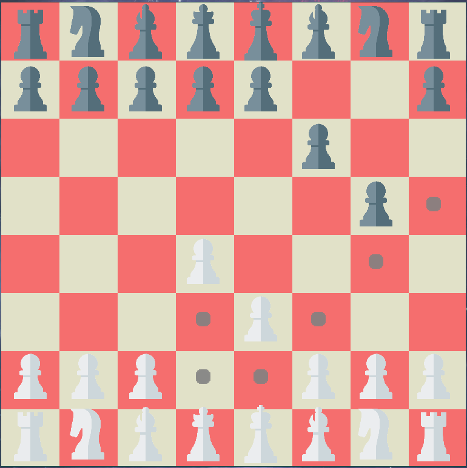

# 2048

An implementation of a classic chess game I once wrote. I'm currently working on a Fairy Chess implementation, so this one will be completely rewritten.



## build

The following should work:

```
cmake -S . -B build
cmake --build build --config Release
cd build/bin/
```
